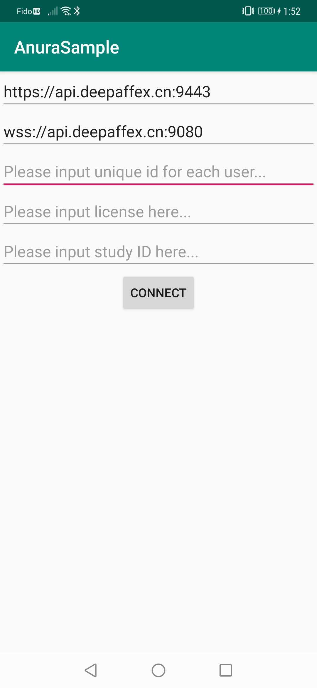
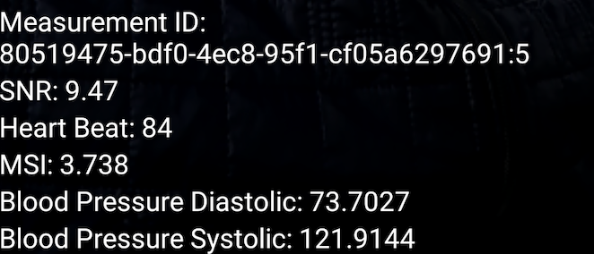

# Anura Core SDK for Android

This repository includes Anura Core SDK as a binary and a skeleton sample code which is using the SDK apis to demonstrate live/interactive, facial-blood-flow (FBF) extraction and results in a discrete (single/finite) measurement. 

The Anura Core SDK provides camera module, rendering module and reliable blood-flow extraction module etc. to ensure the valid and stable measurement. The target audience for this Anura Core SDK will extend the functionality to create custom apps incorporating corporate branding, additional UI/UX flow, user admin, location-tracking and other measurement enhancement features.

The face tracker is an essential module for measurement, the SDK provides an adaption interface (FaceTrackerAdapter) to give users flexibility to use any convenient face tracker avialable.

#### 1. Contact us to obtain the credential information

> It includes EMAIL，PASSWORD，LICENSE_KEY，STUDY_ID, VISAGE_KEY

#### 2. Configure server.properties

> Once credential information is avialble, create and configure server.properties file under the project's root folder, the template is in server.properties.template.
>
> For example:

> APPLICATION_ID=[The application id should be the same as the application in visage license]
>
> SAMPLE_REST_URL=https://api.deepaffex.ai:9443
>
> SAMPLE_WS_URL=wss://api.deepaffex.ai:9080

#### 3. Build and run the sample app, you can click CONFIGURATION to do runtime configuring. 

>
> **You don't have to click connect for every measurement**
>
> Click "CONNECT" once will consume one of your activation quotas.

#### 4.Click MEASUREMENT to start

Result showing on measurement screen：

#### 5.License Registration and Token Validation Best Practices:

* On app first install, use the provided DFX license key to register the license by calling the "register license" endpoint:
    https://dfxapiversion10.docs.apiary.io/#reference/0/organizations/register-license
* Store the token string in the device's secure storage. This token must be used for any subsequent API calls to DFX:
    https://dfxapiversion10.docs.apiary.io/#introduction/2.-websocket-transport/2.1-authenticating
* To ensure that the token is valid before making a DFX API call, you can call the "verify token" endpoint, which will return the token's status:
    https://dfxapiversion10.docs.apiary.io/#reference/0/general/verify-token
* If the "ActiveLicense" field in the response is "false" or if the API returns one of the following errors:
	- "INVALID_TOKEN"
	- "LICENSE_EXPIRED"
	- "INACTIVE_LICENSE"
	- "INACTIVE_DEVICE"
	
	then the app must re-register the license.
* If attempting to re-registering the license fails due to license expiry, please contact Nuralogix to renew your license.

